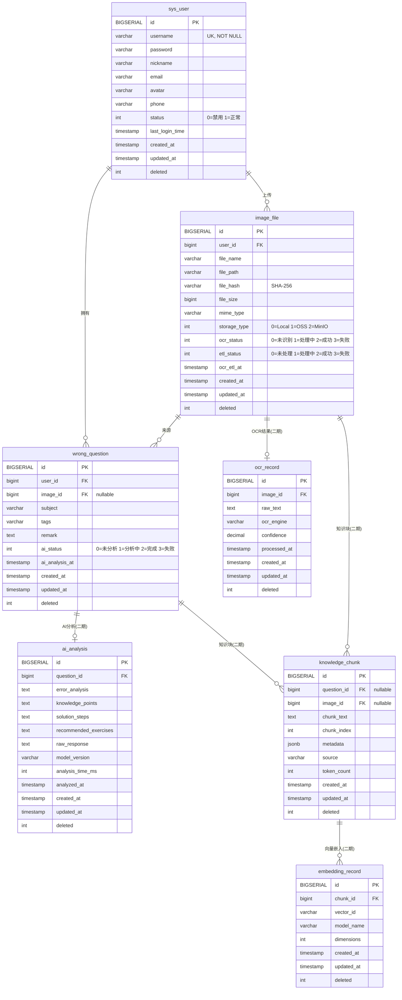

# 数据库设计文档 — AI 错题智能讲解系统

> 版本：1.0
> 数据库：PostgreSQL 16+
> 设计原则：主业务表稳定，扩展能力前置，AI/OCR/Embedding 数据拆表，业务与 AI 解耦

---

## 一、数据库总体架构

```
┌─────────────────────────────────────────────────────┐
│                     sys_user                          │
│           核心用户体系，独立于所有业务                    │
└──────────┬──────────────────────────────────────────┘
           │ 1 : N
┌──────────▼──────────────────────────────────────────┐
│                     image_file                        │
│          文件存储 + OCR/ETL 状态机                     │
└──────────┬──────────────────────────────────────────┘
           │ 1 : N
┌──────────▼──────────────────────────────────────────┐
│                   wrong_question                      │
│    错题主表：稳定、轻量，只存业务语义字段                │
└──────────┬──────────────────────────────────────────┘
           │ 1 : N (预留)
┌──────────┼──────────────────────────────────────────┐
│          │              │              │              │
▼          ▼              ▼              ▼              │
┌──────────┐  ┌──────────┐  ┌──────────┐  ┌──────────┐  │
│ocr_record│  │ai_analysi│  │knowledge_│  │embedding_│  │
│ (未来)   │  │s (未来)  │  │chunk(未来)│  │record   │  │
│OCR原文   │  │AI分析结果│  │RAG Chunk │  │(未来)    │  │
│          │  │错因/知识 │  │          │  │向量映射  │  │
│          │  │点/步骤   │  │          │  │          │  │
└──────────┘  └──────────┘  └──────────┘  └──────────┘
```

**分层思想：**

| 层级 | 表 | 职责 | 稳定性 |
|------|-----|------|--------|
| 用户层 | sys_user | 认证、权限、基础信息 | 极稳定 |
| 资源层 | image_file | 文件存储、OCR/ETL 状态机 | 稳定 |
| 业务层 | wrong_question | 错题业务主表 | 稳定 |
| AI 数据层 | ocr_record / ai_analysis / knowledge_chunk / embedding_record | AI 全链路数据 | 可扩展 |

业务表（用户、文件、错题）在整个项目生命周期中几乎不变。AI 数据表根据 pipeline 演进独立迭代。

---

## 二、每张表的设计

### 2.1 sys_user — 用户表

| 字段 | 类型 | 长度 | 默认值 | NULL | 注释 |
|------|------|------|--------|------|------|
| id | BIGSERIAL | — | — | NOT NULL | 主键 |
| username | VARCHAR | 50 | — | NOT NULL | 用户名，唯一 |
| password | VARCHAR | 255 | — | NOT NULL | BCrypt 加密密码 |
| nickname | VARCHAR | 50 | — | YES | 昵称 |
| email | VARCHAR | 100 | — | YES | 邮箱 |
| avatar | VARCHAR | 500 | — | YES | 头像 URL |
| phone | VARCHAR | 20 | — | YES | 手机号 |
| status | INT | — | 1 | NOT NULL | 状态：0=禁用，1=正常 |
| last_login_time | TIMESTAMP | — | — | YES | 最近登录时间 |
| created_at | TIMESTAMP | — | NOW() | NOT NULL | 创建时间 |
| updated_at | TIMESTAMP | — | NOW() | NOT NULL | 更新时间 |
| deleted | INT | — | 0 | NOT NULL | 逻辑删除：0=未删，1=已删 |

**设计理由：**

*   **username UNIQUE 而非 email UNIQUE**：用户名在注册时确定且终身不变，email 可能变更。用 username 作登录凭证更稳定。
*   **password 用 VARCHAR(255) 而非固定长度**：BCrypt 输出长度因版本不同而异（60~255），留足空间避免升级兼容性问题。
*   **avatar 用 VARCHAR(500) 而非存储二进制**：图片存 OSS/MinIO，DB 只存 URL。binlog 不膨胀，读写不阻塞。
*   **last_login_time 预留在用户表而非单独登录日志表**：90% 查询只需最新登录时间，单表查避免 JOIN。详细登录日志可后续建 `user_login_log` 表。
*   **status 用 INT 而非 BOOLEAN**：未来可能扩展「未激活」「锁定」状态，BOOLEAN 无法扩展。
*   **phone/email 允许 NULL**：V1 支持用户名+密码登录即可，实名绑定是增量需求。

### 2.2 image_file — 文件表

| 字段 | 类型 | 长度 | 默认值 | NULL | 注释 |
|------|------|------|--------|------|------|
| id | BIGSERIAL | — | — | NOT NULL | 主键 |
| user_id | BIGINT | — | — | NOT NULL | 上传用户 ID |
| file_name | VARCHAR | 255 | — | NOT NULL | 原始文件名 |
| file_path | VARCHAR | 500 | — | NOT NULL | 存储路径 |
| file_hash | VARCHAR | 64 | — | YES | SHA-256 文件哈希 |
| file_size | BIGINT | — | 0 | NOT NULL | 文件大小（字节） |
| mime_type | VARCHAR | 100 | — | YES | MIME 类型 |
| storage_type | INT | — | 0 | NOT NULL | 存储类型：0=Local，1=OSS，2=MinIO |
| ocr_status | INT | — | 0 | NOT NULL | OCR 状态：0=未识别，1=处理中，2=成功，3=失败 |
| etl_status | INT | — | 0 | NOT NULL | ETL 状态：0=未处理，1=处理中，2=成功，3=失败 |
| ocr_etl_at | TIMESTAMP | — | — | YES | 最近 OCR+ETL 完成时间 |
| created_at | TIMESTAMP | — | NOW() | NOT NULL | 创建时间 |
| updated_at | TIMESTAMP | — | NOW() | NOT NULL | 更新时间 |
| deleted | INT | — | 0 | NOT NULL | 逻辑删除：0=未删，1=已删 |

**设计理由：**

*   **file_hash(VARCHAR(64))**：SHA-256 输出 64 字符十六进制串。用于秒级去重：上传前先查 hash 是否存在，相同文件不重复存储。固定长度 64，索引效率高。
*   **file_size 用 BIGINT 而非 INT**：一张高清试卷扫描件可达 10~20MB，INT 上限约 2GB 虽够，但 BIGINT 符合 PostgreSQL int8 惯例，避免未来存 PDF 含大量图片时溢出。
*   **storage_type 用 INT**：V1 用 Local，后续接入 OSS/MinIO 只改枚举值，不需 DDL。0/1/2 便于 switch-case。
*   **ocr_status / etl_status 独立而非一个字段**：OCR 和 ETL 是两个异步阶段，可能并发或各自重试。合并为一个字段无法表达「OCR 成功而 ETL 失败」的中间态。
*   **ocr_etl_at 记录最近处理时间**：便于监控 OCR/ETL 流水线延迟。配合 status 可定位卡在哪个环节。
*   **不存 OCR 文本**：OCR 文本是 AI 分析流水线的中间产物，不应混入文件表。从 file 到 wrong_question 的语义已足够。OCR 文本将来放在 `ocr_record` 表。

**为什么不用 OSS URL 作为主键？**  
URL 可能因域名/桶策略变更而改变。BIGSERIAL 代理主键稳定且 JOIN 效率更高。

### 2.3 wrong_question — 错题表

| 字段 | 类型 | 长度 | 默认值 | NULL | 注释 |
|------|------|------|--------|------|------|
| id | BIGSERIAL | — | — | NOT NULL | 主键 |
| user_id | BIGINT | — | — | NOT NULL | 所属用户 ID |
| image_id | BIGINT | — | — | YES | 来源图片 ID |
| subject | VARCHAR | 50 | — | YES | 学科（数学/物理/英语…） |
| tags | VARCHAR | 500 | — | YES | 标签，JSON 数组或逗号分隔 |
| remark | TEXT | — | — | YES | 用户备注 |
| ai_status | INT | — | 0 | NOT NULL | AI 分析状态：0=未分析，1=分析中，2=完成，3=失败 |
| ai_analysis_at | TIMESTAMP | — | — | YES | 最近 AI 分析时间 |
| created_at | TIMESTAMP | — | NOW() | NOT NULL | 创建时间 |
| updated_at | TIMESTAMP | — | NOW() | NOT NULL | 更新时间 |
| deleted | INT | — | 0 | NOT NULL | 逻辑删除：0=未删，1=已删 |

**设计理由：**

*   **image_id 允许 NULL**：用户可能手动录入错题不经过图片上传，V1 支持直接创建。
*   **tags 用 VARCHAR(500) 而非关联表**：V1 标签查询量极低，一条错题标签数通常 < 5 个。单字段省去 tag/tag_ref 两张表的 JOIN 开销。后续标签搜索量上升时再用标签中间表重构。
*   **remark 用 TEXT 而非 VARCHAR**：备注内容不限长度，用户可能写详细批注。VARCHAR(N) 在 N > 255 时在 PostgreSQL 中与 TEXT 存储方式相同，但 TEXT 语义更清晰。
*   **ai_status 而不直接存分析结果**：分析是异步长任务（秒级~分钟级）。status 允许前端轮询显示「分析中」「已完成」。结果数据量大、结构复杂，拆到 `ai_analysis` 表。
*   **ai_analysis_at**：与 image_file.ocr_etl_at 对称，可追踪 AI pipeline 每段耗时。
*   **不存 OCR 原文 / AI 回答 / 向量 / 知识点**：这些都是 AI Pipeline 的产物，拆到扩展表，业务表不染指。

### 2.4 ocr_record — OCR 记录表（二期）

| 字段 | 类型 | 长度 | 默认值 | NULL | 注释 |
|------|------|------|--------|------|------|
| id | BIGSERIAL | — | — | NOT NULL | 主键 |
| image_id | BIGINT | — | — | NOT NULL | 关联图片 ID |
| raw_text | TEXT | — | — | NOT NULL | OCR 原始文本 |
| ocr_engine | VARCHAR | 100 | — | YES | OCR 引擎标识 |
| confidence | DECIMAL | 5,4 | — | YES | 识别置信度 |
| processed_at | TIMESTAMP | — | — | YES | 识别完成时间 |
| created_at | TIMESTAMP | — | NOW() | NOT NULL | 创建时间 |
| updated_at | TIMESTAMP | — | NOW() | NOT NULL | 更新时间 |
| deleted | INT | — | 0 | NOT NULL | 逻辑删除 |

### 2.5 ai_analysis — AI 分析结果表（二期）

| 字段 | 类型 | 长度 | 默认值 | NULL | 注释 |
|------|------|------|--------|------|------|
| id | BIGSERIAL | — | — | NOT NULL | 主键 |
| question_id | BIGINT | — | — | NOT NULL | 关联错题 ID |
| error_analysis | TEXT | — | — | YES | 错因分析 |
| knowledge_points | TEXT | — | — | YES | 知识点列表，JSON 数组 |
| solution_steps | TEXT | — | — | YES | 解题步骤，Markdown |
| recommended_exercises | TEXT | — | — | YES | 推荐练习，JSON 数组 |
| raw_response | TEXT | — | — | YES | LLM 原始返回（调试用） |
| model_version | VARCHAR | 100 | — | YES | AI 模型版本 |
| analysis_time_ms | INT | — | — | YES | 分析耗时（毫秒） |
| analyzed_at | TIMESTAMP | — | — | YES | 分析完成时间 |
| created_at | TIMESTAMP | — | NOW() | NOT NULL | 创建时间 |
| updated_at | TIMESTAMP | — | NOW() | NOT NULL | 更新时间 |
| deleted | INT | — | 0 | NOT NULL | 逻辑删除 |

**设计理由：**

*   所有 AI 分析字段用 TEXT 而非固定长度 JSONB：不同模型输出结构可能变化，TEXT 兼容 Markdown/JSON/XML 而无需 schema 迁移。上层应用自行解析。
*   **raw_response**：存储 LLM 原始输出，用于调优 prompt 和回归测试。生产环境可定期清理。
*   **model_version**：追踪分析结果由哪个模型产生，模型升级后可对比质量。

### 2.6 knowledge_chunk — 知识块表（二期）

| 字段 | 类型 | 长度 | 默认值 | NULL | 注释 |
|------|------|------|--------|------|------|
| id | BIGSERIAL | — | — | NOT NULL | 主键 |
| question_id | BIGINT | — | — | YES | 关联错题 ID |
| image_id | BIGINT | — | — | YES | 关联图片 ID |
| chunk_text | TEXT | — | — | NOT NULL | Chunk 文本内容 |
| chunk_index | INT | — | 0 | NOT NULL | 块序号 |
| metadata | JSONB | — | '{}' | NOT NULL | 元数据（来源、页码等） |
| source | VARCHAR | 50 | — | YES | 来源：ocr/analysis/manual |
| token_count | INT | — | — | YES | Token 数 |
| created_at | TIMESTAMP | — | NOW() | NOT NULL | 创建时间 |
| updated_at | TIMESTAMP | — | NOW() | NOT NULL | 更新时间 |
| deleted | INT | — | 0 | NOT NULL | 逻辑删除 |

**设计理由：**

*   **question_id 和 image_id 都允许 NULL**：Chunk 可能来自 OCR 原文（关联 image）或 AI 分析结果（关联 question），两者是 OR 关系而非 AND。
*   **metadata 用 JSONB**：不同来源的 chunk 携带不同元数据（页码、标题层级、分析类型等）。JSONB 支持 GIN 索引，未来可全文检索。
*   **chunk_index + source**：支持从多个来源并行分块，追溯原始文档结构。

### 2.7 embedding_record — 向量嵌入记录表（二期）

| 字段 | 类型 | 长度 | 默认值 | NULL | 注释 |
|------|------|------|--------|------|------|
| id | BIGSERIAL | — | — | NOT NULL | 主键 |
| chunk_id | BIGINT | — | — | NOT NULL | 关联 Chunk ID |
| vector_id | VARCHAR | 255 | — | NOT NULL | 向量数据库中的 ID |
| model_name | VARCHAR | 100 | — | NOT NULL | Embedding 模型名称 |
| dimensions | INT | — | — | YES | 向量维度 |
| created_at | TIMESTAMP | — | NOW() | NOT NULL | 创建时间 |
| updated_at | TIMESTAMP | — | NOW() | NOT NULL | 更新时间 |
| deleted | INT | — | 0 | NOT NULL | 逻辑删除 |

**设计理由：**

*   **PostgreSQL 不存向量值**：向量存在独立的向量数据库（pgvector / Milvus / Qdrant），`vector_id` 是对应记录的外键。
*   **chunk_id → embedding_record → vector_db**：三层映射，chunk 可以拥有多个 embedding（不同模型重嵌入时），历史向量不被覆盖。
*   **model_name + dimensions**：监控不同模型的效果。同一份 chunk 用不同模型嵌入后可 A/B 测试检索精度。

---

## 三、SQL 建表语句（PostgreSQL）

```sql
-- ============================================================
-- 1. 用户表
-- ============================================================
CREATE TABLE sys_user (
    id              BIGSERIAL       PRIMARY KEY,
    username        VARCHAR(50)     NOT NULL,
    password        VARCHAR(255)    NOT NULL,
    nickname        VARCHAR(50),
    email           VARCHAR(100),
    avatar          VARCHAR(500),
    phone           VARCHAR(20),
    status          INT             NOT NULL DEFAULT 1,
    last_login_time TIMESTAMP,
    created_at      TIMESTAMP       NOT NULL DEFAULT NOW(),
    updated_at      TIMESTAMP       NOT NULL DEFAULT NOW(),
    deleted         INT             NOT NULL DEFAULT 0
);

COMMENT ON TABLE  sys_user               IS '用户表';
COMMENT ON COLUMN sys_user.id            IS '主键';
COMMENT ON COLUMN sys_user.username      IS '用户名，唯一';
COMMENT ON COLUMN sys_user.password      IS 'BCrypt 加密密码';
COMMENT ON COLUMN sys_user.nickname      IS '昵称';
COMMENT ON COLUMN sys_user.email         IS '邮箱';
COMMENT ON COLUMN sys_user.avatar        IS '头像 URL';
COMMENT ON COLUMN sys_user.phone         IS '手机号';
COMMENT ON COLUMN sys_user.status        IS '状态：0=禁用，1=正常';
COMMENT ON COLUMN sys_user.last_login_time IS '最近登录时间';
COMMENT ON COLUMN sys_user.created_at    IS '创建时间';
COMMENT ON COLUMN sys_user.updated_at    IS '更新时间';
COMMENT ON COLUMN sys_user.deleted       IS '逻辑删除：0=未删，1=已删';

-- 索引
CREATE UNIQUE INDEX idx_sys_user_username ON sys_user(username) WHERE deleted = 0;
CREATE INDEX idx_sys_user_status ON sys_user(status);
CREATE INDEX idx_sys_user_email ON sys_user(email) WHERE deleted = 0;
CREATE INDEX idx_sys_user_created_at ON sys_user(created_at);

-- ============================================================
-- 2. 文件表
-- ============================================================
CREATE TABLE image_file (
    id              BIGSERIAL       PRIMARY KEY,
    user_id         BIGINT          NOT NULL,
    file_name       VARCHAR(255)    NOT NULL,
    file_path       VARCHAR(500)    NOT NULL,
    file_hash       VARCHAR(64),
    file_size       BIGINT          NOT NULL DEFAULT 0,
    mime_type       VARCHAR(100),
    storage_type    INT             NOT NULL DEFAULT 0,
    ocr_status      INT             NOT NULL DEFAULT 0,
    etl_status      INT             NOT NULL DEFAULT 0,
    ocr_etl_at      TIMESTAMP,
    created_at      TIMESTAMP       NOT NULL DEFAULT NOW(),
    updated_at      TIMESTAMP       NOT NULL DEFAULT NOW(),
    deleted         INT             NOT NULL DEFAULT 0
);

COMMENT ON TABLE  image_file              IS '上传文件表（图片/PDF）';
COMMENT ON COLUMN image_file.id           IS '主键';
COMMENT ON COLUMN image_file.user_id      IS '上传用户 ID';
COMMENT ON COLUMN image_file.file_name    IS '原始文件名';
COMMENT ON COLUMN image_file.file_path    IS '存储路径（含存储类型前缀）';
COMMENT ON COLUMN image_file.file_hash    IS 'SHA-256 文件哈希';
COMMENT ON COLUMN image_file.file_size    IS '文件大小（字节）';
COMMENT ON COLUMN image_file.mime_type    IS 'MIME 类型';
COMMENT ON COLUMN image_file.storage_type IS '存储类型：0=Local，1=OSS，2=MinIO';
COMMENT ON COLUMN image_file.ocr_status   IS 'OCR 状态：0=未识别，1=处理中，2=成功，3=失败';
COMMENT ON COLUMN image_file.etl_status   IS 'ETL 状态：0=未处理，1=处理中，2=成功，3=失败';
COMMENT ON COLUMN image_file.ocr_etl_at   IS '最近 OCR+ETL 完成时间';
COMMENT ON COLUMN image_file.created_at   IS '创建时间';
COMMENT ON COLUMN image_file.updated_at   IS '更新时间';
COMMENT ON COLUMN image_file.deleted      IS '逻辑删除：0=未删，1=已删';

-- 索引
CREATE INDEX idx_image_file_user_id ON image_file(user_id) WHERE deleted = 0;
CREATE INDEX idx_image_file_file_hash ON image_file(file_hash) WHERE deleted = 0 AND file_hash IS NOT NULL;
CREATE INDEX idx_image_file_ocr_status ON image_file(ocr_status);
CREATE INDEX idx_image_file_etl_status ON image_file(etl_status);
CREATE INDEX idx_image_file_created_at ON image_file(created_at);

-- ============================================================
-- 3. 错题表
-- ============================================================
CREATE TABLE wrong_question (
    id              BIGSERIAL       PRIMARY KEY,
    user_id         BIGINT          NOT NULL,
    image_id        BIGINT,
    subject         VARCHAR(50),
    tags            VARCHAR(500),
    remark          TEXT,
    ai_status       INT             NOT NULL DEFAULT 0,
    ai_analysis_at  TIMESTAMP,
    created_at      TIMESTAMP       NOT NULL DEFAULT NOW(),
    updated_at      TIMESTAMP       NOT NULL DEFAULT NOW(),
    deleted         INT             NOT NULL DEFAULT 0
);

COMMENT ON TABLE  wrong_question              IS '错题记录表';
COMMENT ON COLUMN wrong_question.id           IS '主键';
COMMENT ON COLUMN wrong_question.user_id      IS '所属用户 ID';
COMMENT ON COLUMN wrong_question.image_id     IS '来源图片 ID';
COMMENT ON COLUMN wrong_question.subject      IS '学科';
COMMENT ON COLUMN wrong_question.tags         IS '标签，JSON 数组';
COMMENT ON COLUMN wrong_question.remark       IS '用户备注';
COMMENT ON COLUMN wrong_question.ai_status    IS 'AI 分析状态：0=未分析，1=分析中，2=完成，3=失败';
COMMENT ON COLUMN wrong_question.ai_analysis_at IS '最近 AI 分析时间';
COMMENT ON COLUMN wrong_question.created_at   IS '创建时间';
COMMENT ON COLUMN wrong_question.updated_at   IS '更新时间';
COMMENT ON COLUMN wrong_question.deleted      IS '逻辑删除：0=未删，1=已删';

-- 索引
CREATE INDEX idx_wrong_question_user_id ON wrong_question(user_id) WHERE deleted = 0;
CREATE INDEX idx_wrong_question_image_id ON wrong_question(image_id) WHERE deleted = 0 AND image_id IS NOT NULL;
CREATE INDEX idx_wrong_question_subject ON wrong_question(subject) WHERE deleted = 0 AND subject IS NOT NULL;
CREATE INDEX idx_wrong_question_ai_status ON wrong_question(ai_status);
CREATE INDEX idx_wrong_question_created_at ON wrong_question(created_at);
-- 复合索引：用户最常按「我的错题」列表查询
CREATE INDEX idx_wq_user_created ON wrong_question(user_id, created_at DESC) WHERE deleted = 0;

-- ============================================================
-- 4. OCR 记录表（二期）
-- ============================================================
CREATE TABLE ocr_record (
    id              BIGSERIAL       PRIMARY KEY,
    image_id        BIGINT          NOT NULL,
    raw_text        TEXT            NOT NULL,
    ocr_engine      VARCHAR(100),
    confidence      DECIMAL(5,4),
    processed_at    TIMESTAMP,
    created_at      TIMESTAMP       NOT NULL DEFAULT NOW(),
    updated_at      TIMESTAMP       NOT NULL DEFAULT NOW(),
    deleted         INT             NOT NULL DEFAULT 0
);

COMMENT ON TABLE  ocr_record             IS 'OCR 识别记录表';
COMMENT ON COLUMN ocr_record.id          IS '主键';
COMMENT ON COLUMN ocr_record.image_id    IS '关联图片 ID';
COMMENT ON COLUMN ocr_record.raw_text    IS 'OCR 原始文本';
COMMENT ON COLUMN ocr_record.ocr_engine  IS 'OCR 引擎标识';
COMMENT ON COLUMN ocr_record.confidence  IS '识别置信度';
COMMENT ON COLUMN ocr_record.processed_at IS '识别完成时间';

CREATE INDEX idx_ocr_record_image_id ON ocr_record(image_id) WHERE deleted = 0;

-- ============================================================
-- 5. AI 分析结果表（二期）
-- ============================================================
CREATE TABLE ai_analysis (
    id                      BIGSERIAL       PRIMARY KEY,
    question_id             BIGINT          NOT NULL,
    error_analysis          TEXT,
    knowledge_points        TEXT,
    solution_steps          TEXT,
    recommended_exercises   TEXT,
    raw_response            TEXT,
    model_version           VARCHAR(100),
    analysis_time_ms        INT,
    analyzed_at             TIMESTAMP,
    created_at              TIMESTAMP       NOT NULL DEFAULT NOW(),
    updated_at              TIMESTAMP       NOT NULL DEFAULT NOW(),
    deleted                 INT             NOT NULL DEFAULT 0
);

COMMENT ON TABLE  ai_analysis                   IS 'AI 分析结果表';
COMMENT ON COLUMN ai_analysis.id                IS '主键';
COMMENT ON COLUMN ai_analysis.question_id       IS '关联错题 ID';
COMMENT ON COLUMN ai_analysis.error_analysis    IS '错因分析';
COMMENT ON COLUMN ai_analysis.knowledge_points  IS '知识点列表，JSON 数组';
COMMENT ON COLUMN ai_analysis.solution_steps    IS '解题步骤';
COMMENT ON COLUMN ai_analysis.recommended_exercises IS '推荐练习，JSON 数组';
COMMENT ON COLUMN ai_analysis.raw_response      IS 'LLM 原始返回';
COMMENT ON COLUMN ai_analysis.model_version     IS 'AI 模型版本';
COMMENT ON COLUMN ai_analysis.analysis_time_ms  IS '分析耗时';
COMMENT ON COLUMN ai_analysis.analyzed_at       IS '分析完成时间';

CREATE INDEX idx_ai_analysis_question_id ON ai_analysis(question_id) WHERE deleted = 0;

-- ============================================================
-- 6. 知识块表（二期）
-- ============================================================
CREATE TABLE knowledge_chunk (
    id              BIGSERIAL       PRIMARY KEY,
    question_id     BIGINT,
    image_id        BIGINT,
    chunk_text      TEXT            NOT NULL,
    chunk_index     INT             NOT NULL DEFAULT 0,
    metadata        JSONB           NOT NULL DEFAULT '{}',
    source          VARCHAR(50),
    token_count     INT,
    created_at      TIMESTAMP       NOT NULL DEFAULT NOW(),
    updated_at      TIMESTAMP       NOT NULL DEFAULT NOW(),
    deleted         INT             NOT NULL DEFAULT 0
);

COMMENT ON TABLE  knowledge_chunk               IS '知识块表（RAG Chunk）';
COMMENT ON COLUMN knowledge_chunk.id            IS '主键';
COMMENT ON COLUMN knowledge_chunk.question_id   IS '关联错题 ID';
COMMENT ON COLUMN knowledge_chunk.image_id      IS '关联图片 ID';
COMMENT ON COLUMN knowledge_chunk.chunk_text    IS 'Chunk 文本内容';
COMMENT ON COLUMN knowledge_chunk.chunk_index   IS '块序号';
COMMENT ON COLUMN knowledge_chunk.metadata      IS '元数据';
COMMENT ON COLUMN knowledge_chunk.source        IS '来源：ocr/analysis/manual';
COMMENT ON COLUMN knowledge_chunk.token_count   IS 'Token 数';

CREATE INDEX idx_kc_question_id ON knowledge_chunk(question_id) WHERE deleted = 0 AND question_id IS NOT NULL;
CREATE INDEX idx_kc_image_id ON knowledge_chunk(image_id) WHERE deleted = 0 AND image_id IS NOT NULL;
CREATE INDEX idx_kc_source ON knowledge_chunk(source);
-- 支持全文检索
CREATE INDEX idx_kc_metadata ON knowledge_chunk USING GIN (metadata);
CREATE INDEX idx_kc_created_at ON knowledge_chunk(created_at);

-- ============================================================
-- 7. 向量嵌入记录表（二期）
-- ============================================================
CREATE TABLE embedding_record (
    id              BIGSERIAL       PRIMARY KEY,
    chunk_id        BIGINT          NOT NULL,
    vector_id       VARCHAR(255)    NOT NULL,
    model_name      VARCHAR(100)    NOT NULL,
    dimensions      INT,
    created_at      TIMESTAMP       NOT NULL DEFAULT NOW(),
    updated_at      TIMESTAMP       NOT NULL DEFAULT NOW(),
    deleted         INT             NOT NULL DEFAULT 0
);

COMMENT ON TABLE  embedding_record             IS '向量嵌入记录表';
COMMENT ON COLUMN embedding_record.id          IS '主键';
COMMENT ON COLUMN embedding_record.chunk_id    IS '关联 Chunk ID';
COMMENT ON COLUMN embedding_record.vector_id   IS '向量数据库中的 ID';
COMMENT ON COLUMN embedding_record.model_name  IS 'Embedding 模型名称';
COMMENT ON COLUMN embedding_record.dimensions  IS '向量维度';

CREATE INDEX idx_er_chunk_id ON embedding_record(chunk_id) WHERE deleted = 0;
CREATE INDEX idx_er_model_name ON embedding_record(model_name);
CREATE INDEX idx_er_vector_id ON embedding_record(vector_id);
```

---

## 四、Mermaid ER 图



---

## 五、索引设计总览

| 表 | 索引名 | 类型 | 列 | 条件 | 用途 |
|----|--------|------|----|------|------|
| sys_user | idx_sys_user_username | UNIQUE | username | deleted=0 | 登录查询，唯一约束 |
| sys_user | idx_sys_user_email | BTREE | email | deleted=0 | 邮箱登录（预留） |
| sys_user | idx_sys_user_status | BTREE | status | — | 后台筛选活跃/禁用用户 |
| sys_user | idx_sys_user_created_at | BTREE | created_at | — | 用户列表排序 |
| image_file | idx_image_file_user_id | BTREE | user_id | deleted=0 | 用户文件列表 |
| image_file | idx_image_file_file_hash | BTREE | file_hash | deleted=0 | 文件去重 |
| image_file | idx_image_file_ocr_status | BTREE | ocr_status | — | OCR 任务调度 |
| image_file | idx_image_file_etl_status | BTREE | etl_status | — | ETL 任务调度 |
| image_file | idx_image_file_created_at | BTREE | created_at | — | 文件列表排序 |
| wrong_question | idx_wrong_question_user_id | BTREE | user_id | deleted=0 | 用户错题列表 |
| wrong_question | idx_wrong_question_image_id | BTREE | image_id | deleted=0 | 图片→错题关联 |
| wrong_question | idx_wrong_question_subject | BTREE | subject | deleted=0 | 按学科筛选 |
| wrong_question | idx_wrong_question_ai_status | BTREE | ai_status | — | AI 任务调度 |
| wrong_question | idx_wrong_question_created_at | BTREE | created_at | — | 错题列表排序 |
| wrong_question | idx_wq_user_created | BTREE | user_id, created_at DESC | deleted=0 | 高频复合查询 |
| ocr_record | idx_ocr_record_image_id | BTREE | image_id | deleted=0 | OCR→图片关联 |
| ai_analysis | idx_ai_analysis_question_id | BTREE | question_id | deleted=0 | 分析→错题关联 |
| knowledge_chunk | idx_kc_question_id | BTREE | question_id | deleted=0 | Chunk→错题关联 |
| knowledge_chunk | idx_kc_image_id | BTREE | image_id | deleted=0 | Chunk→图片关联 |
| knowledge_chunk | idx_kc_source | BTREE | source | — | 按来源筛选 |
| knowledge_chunk | idx_kc_metadata | GIN | metadata | — | JSON 元数据查询 |
| knowledge_chunk | idx_kc_created_at | BTREE | created_at | — | Chunk 列表排序 |
| embedding_record | idx_er_chunk_id | BTREE | chunk_id | deleted=0 | Embedding→Chunk |
| embedding_record | idx_er_model_name | BTREE | model_name | — | 模型筛选 |
| embedding_record | idx_er_vector_id | BTREE | vector_id | — | 向量数据库反向查找 |

**索引设计原则：**

*   **用户查询全覆盖**：`user_id` 几乎出现在所有业务查询中，三张业务表都在 `user_id` 上建了索引。
*   **复合索引优先于多个单列索引**：`idx_wq_user_created` 覆盖「我的错题按时间倒排」这个最高频场景，避免排序走全表。
*   **部分索引（WHERE deleted=0）**：80% 查询忽略已删除数据，部分索引体积减少 3~5 倍，写入时 B-tree 分裂更少。
*   **状态索引不设 WHERE 条件**：OCR/ETL/AI 状态值离散（0/1/2/3），即使已删除记录也需要被后台调度扫描处理（例如重试失败任务）。
*   **GIN 索引只建在 metadata (JSONB)**：chunk_text 未来可能上 pg_trgm 或全文检索索引，V1 暂不确定分词策略，留到 V2 按实际 query pattern 定。

---

## 六、后续扩展方案

### 6.1 标签系统重构

当标签查询量和关联场景上升时（按标签筛选错题、推荐相似题），从单字段改为关联表：

```sql
CREATE TABLE tag (
    id   BIGSERIAL   PRIMARY KEY,
    name VARCHAR(50) NOT NULL UNIQUE
);

CREATE TABLE question_tag (
    question_id BIGINT NOT NULL,
    tag_id      BIGINT NOT NULL,
    created_at  TIMESTAMP NOT NULL DEFAULT NOW(),
    PRIMARY KEY (question_id, tag_id)
);
```

V1 先用 VARCHAR 顶着，100 万条错题以内 VARCHAR 查询 + 应用层聚合完全够用。

### 6.2 向量数据库接入

一期开发只需在配置文件中声明 pgvector 连接信息。二期 `embedding_record.vector_id` 即指向 pgvector 表的 ID：

```sql
-- 在 pgvector schema 中
CREATE TABLE vector_store (
    id          VARCHAR(255) PRIMARY KEY,
    embedding   vector(1536) NOT NULL,
    chunk_id    BIGINT,
    created_at  TIMESTAMP NOT NULL DEFAULT NOW()
);
```

PostgreSQL 业务库与向量库通过应用层（Spring AI / LangChain4j）协调，不建 DB link。

### 6.3 AI Pipeline 全链路追踪

扩展 `image_file` / `wrong_question` 的 status 字段为更精细的事件表：

```sql
CREATE TABLE pipeline_event (
    id            BIGSERIAL    PRIMARY KEY,
    business_type VARCHAR(50)  NOT NULL,  -- file/question
    business_id   BIGINT       NOT NULL,
    stage         VARCHAR(50)  NOT NULL,  -- ocr/etl/ai_analyze
    status        INT          NOT NULL,  -- 0=pending 1=running 2=success 3=failed
    error_message TEXT,
    started_at    TIMESTAMP,
    finished_at   TIMESTAMP,
    created_at    TIMESTAMP    NOT NULL DEFAULT NOW()
);
```

V1 三张业务表的 status INT 字段满足 99% 的查询需求。实时流水线监控时才需要建事件表。

### 6.4 分表策略

当单表超过 5000 万行时：

| 表 | 分表键 | 策略 |
|----|--------|------|
| wrong_question | user_id | 按 user_id 哈希分 16 表 |
| image_file | user_id | 按 user_id 哈希分 16 表 |
| knowledge_chunk | question_id | 按 question_id 哈希分 32 表 |

PostgreSQL 分区表（PARTITION BY HASH）原生支持，无需改代码。

---

## 七、为什么符合企业项目设计规范

### 7.1 业务表与 AI 数据解耦

**典型培训项目**的做法是把所有字段塞进一张表：

```sql
-- ❌ 反例：一张大表塞全部
CREATE TABLE wrong_question (
    id BIGSERIAL,
    user_id BIGINT,
    ocr_text TEXT,
    error_analysis TEXT,
    knowledge_points TEXT,
    embedding vector(1536),
    ...
);
```

问题：OCR 重跑时更新 `ocr_text` 锁住整行，AI 查询慢占用连接，无法独立扩展。

**本设计的做法：**

| 职责 | 表 | 扩容方式 |
|------|----|----------|
| 用户认证 | sys_user | 写少读多，加从库 |
| 文件 & 状态机 | image_file | 状态扫描走单独索引 |
| 错题主业务 | wrong_question | 稳如磐石 |
| OCR 文本 | ocr_record | 异步写入，不阻塞业务 |
| AI 分析 | ai_analysis | TEXT 大字段不拖慢主表 |
| Chunk + 向量 | knowledge_chunk + embedding_record | 独立分表策略 |

AI pipeline 中的每一层都可以独立：
- 升级 OCR 引擎 → 重新写入 `ocr_record`，不改其他表
- 换 embedding 模型 → 新的 `embedding_record` 行，不回退旧数据
- 切换 LLM → `model_version` 追踪，可 A/B 对比

### 7.2 扩展能力前置

**不是提前设计所有字段，而是预留扩展点：**

- `storage_type INT` 而非 `is_local BOOLEAN` → 新增 MinIO 不改 DDL
- `ai_status INT` 而非 `is_analyzed BOOLEAN` → 表达处理中/失败等中间态
- 逻辑删除用 `deleted INT` 而非 `deleted_at TIMESTAMP` → 可与 status 统一枚举管理
- 标签用 VARCHAR(500) 而非关联表 → V1 零 JOIN，V2 改关联表不伤历史数据

### 7.3 索引策略务实

- 部分索引（`WHERE deleted=0`）减少写放大
- 复合索引对应最高频查询，而非盲目对所有列建索引
- 状态索引不设条件，允许后台扫描已删除记录的重试场景
- GIN 索引只用于 JSONB，chunk_text 的检索策略推迟到 V2 按实际模式定

### 7.4 不建数据库外键

```sql
-- ✅ image_file.user_id 是逻辑外键，但无 CONSTRAINT
user_id BIGINT NOT NULL
-- 而非
user_id BIGINT NOT NULL REFERENCES sys_user(id)
```

理由：
- **微服务拆分**：日后 user 服务独立部署，DB 层无法跨库约束
- **批量写入性能**：外键每行插入多一次行级锁检查
- **逻辑删除兼容**：外键不允许引用已逻辑删除的行
- **补偿机制**：应用层通过定时扫描 + 告警保证最终一致性

### 7.5 主键与时间字段统一

每张表都用 `BIGSERIAL` 作为代理主键，配合统一的 `created_at / updated_at / deleted`，好处：

- **ORM 统一映射**：MyBatis Plus 的 BaseEntity 可直接复用
- **代码生成器**：一键生成所有 CRUD，零配置
- **数据归档**：按 `created_at` 范围统一清理冷数据

`BIGSERIAL`（等价于 `BIGINT` + 自增序列）相比 `UUID`：
- 索引体积：8 bytes vs 16 bytes
- 写入性能：顺序写入无页分裂 vs 随机写入导致 B-tree 频繁分裂
- 运维友好：自增 ID 可直接用于分表路由
- 业务安全：对外暴露时用 Snowflake ID 或 HashID 转换，不暴露真实自增值

---

## 八、第一阶段可直接运行的 SQL

以下是一期开发直接执行的建表顺序（用户→文件→错题），三条 SQL 建完开局：

```sql
-- 1. 用户表
CREATE TABLE sys_user (
    id              BIGSERIAL       PRIMARY KEY,
    username        VARCHAR(50)     NOT NULL,
    password        VARCHAR(255)    NOT NULL,
    nickname        VARCHAR(50),
    email           VARCHAR(100),
    avatar          VARCHAR(500),
    phone           VARCHAR(20),
    status          INT             NOT NULL DEFAULT 1,
    last_login_time TIMESTAMP,
    created_at      TIMESTAMP       NOT NULL DEFAULT NOW(),
    updated_at      TIMESTAMP       NOT NULL DEFAULT NOW(),
    deleted         INT             NOT NULL DEFAULT 0
);
CREATE UNIQUE INDEX idx_sys_user_username ON sys_user(username) WHERE deleted = 0;
CREATE INDEX idx_sys_user_status ON sys_user(status);
CREATE INDEX idx_sys_user_email ON sys_user(email) WHERE deleted = 0;
CREATE INDEX idx_sys_user_created_at ON sys_user(created_at);

-- 2. 文件表
CREATE TABLE image_file (
    id              BIGSERIAL       PRIMARY KEY,
    user_id         BIGINT          NOT NULL,
    file_name       VARCHAR(255)    NOT NULL,
    file_path       VARCHAR(500)    NOT NULL,
    file_hash       VARCHAR(64),
    file_size       BIGINT          NOT NULL DEFAULT 0,
    mime_type       VARCHAR(100),
    storage_type    INT             NOT NULL DEFAULT 0,
    ocr_status      INT             NOT NULL DEFAULT 0,
    etl_status      INT             NOT NULL DEFAULT 0,
    ocr_etl_at      TIMESTAMP,
    created_at      TIMESTAMP       NOT NULL DEFAULT NOW(),
    updated_at      TIMESTAMP       NOT NULL DEFAULT NOW(),
    deleted         INT             NOT NULL DEFAULT 0
);
CREATE INDEX idx_image_file_user_id ON image_file(user_id) WHERE deleted = 0;
CREATE INDEX idx_image_file_file_hash ON image_file(file_hash) WHERE deleted = 0 AND file_hash IS NOT NULL;
CREATE INDEX idx_image_file_ocr_status ON image_file(ocr_status);
CREATE INDEX idx_image_file_etl_status ON image_file(etl_status);
CREATE INDEX idx_image_file_created_at ON image_file(created_at);

-- 3. 错题表
CREATE TABLE wrong_question (
    id              BIGSERIAL       PRIMARY KEY,
    user_id         BIGINT          NOT NULL,
    image_id        BIGINT,
    subject         VARCHAR(50),
    tags            VARCHAR(500),
    remark          TEXT,
    ai_status       INT             NOT NULL DEFAULT 0,
    ai_analysis_at  TIMESTAMP,
    created_at      TIMESTAMP       NOT NULL DEFAULT NOW(),
    updated_at      TIMESTAMP       NOT NULL DEFAULT NOW(),
    deleted         INT             NOT NULL DEFAULT 0
);
CREATE INDEX idx_wrong_question_user_id ON wrong_question(user_id) WHERE deleted = 0;
CREATE INDEX idx_wrong_question_image_id ON wrong_question(image_id) WHERE deleted = 0 AND image_id IS NOT NULL;
CREATE INDEX idx_wrong_question_subject ON wrong_question(subject) WHERE deleted = 0 AND subject IS NOT NULL;
CREATE INDEX idx_wrong_question_ai_status ON wrong_question(ai_status);
CREATE INDEX idx_wrong_question_created_at ON wrong_question(created_at);
CREATE INDEX idx_wq_user_created ON wrong_question(user_id, created_at DESC) WHERE deleted = 0;
```

三条 DDL + 7 个索引，V1 可直接上线。
