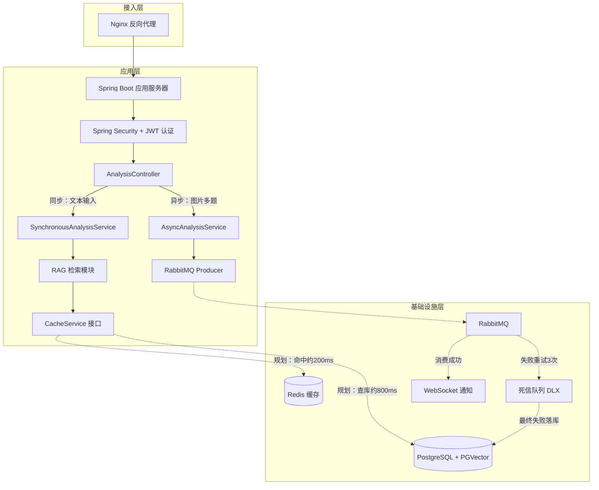
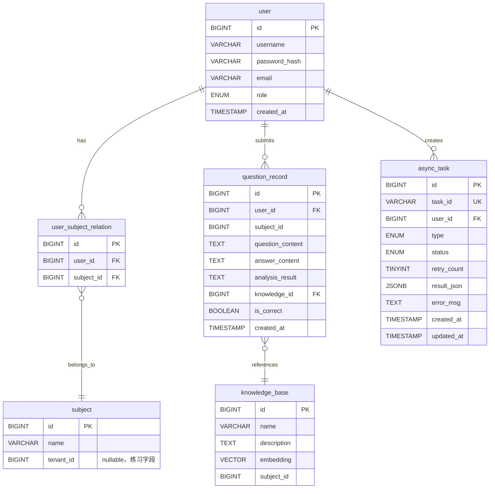

> *本文档在原《项目实践复盘》基础上整合了实施路线图、任务拆分、测试策略和风险管理，形成完整的项目施工图纸。*

---

# AI 错题分析助手 —— 完整项目规划

---

## 1. 项目背景

### 1.1 项目定位

面向初高中学生的 AI 错题分析工具。学生提交错题文本后，系统通过 RAG 检索对应知识点并生成错因分析与同类题推荐。

**MVP 验证结果**：5 名同学内测，3 人在未提示的情况下主动提交了第二道题（留存率 60%），说明核心 RAG + 错因分析对用户有价值。

### 1.2 架构原则

我采用**先跑通核心、再对症下药**的迭代策略：

| 阶段     | 做了什么                | 关键交付                                  |
| -------- | ----------------------- | ----------------------------------------- |
| MVP      | 验证 RAG 分析是否有留存 | 纯文本同步分析链路跑通，PGVector 直查     |
| 当前阶段 | 补权限隔离 + 预留扩展点 | Spring Security RBAC，CacheService 抽象层 |
| 规划阶段 | 解决已验证的性能瓶颈    | Redis 热点缓存，RabbitMQ 异步解耦         |

我的选型原则：先拿到日志/压测数据，再引入中间件，不搞"我觉得需要"式选型。

### 1.3 我的项目动机与学习目标

做这个项目的原因：

- **技术驱动**：想在实践中打通 Spring Boot + 向量数据库 + LLM API 的全链路，而不仅仅是看教程。
- **问题驱动**：观察到自己和身边同学整理纸质错题耗时低效，想验证 AI 能否解决这个具体痛点。
- **学习目标**：重点实践了**缓存抽象层设计**和**异步任务拆分**，这两点是我之前做 CRUD 项目时从未接触过的。

### 1.4 与现有仓库的关系

错题分析助手作为 `yu-ai-agent` 通用 Agent 平台的**垂直业务模块**，放在 `educationaiagent` 包下，复用现有的基础设施：

- `PgVectorVectorStoreConfig` — PGVector 连接与索引配置
- `MyTokenTextSplitter` — 文档分块策略
- DashScope Embedding — 1536 维向量嵌入
- Agent 框架（`ReActAgent` / `ToolCallAgent`）— 未来分析 Agent 可继承

---

## 2. 整体架构图



> **图例说明**：  
> —— **实线箭头**：已实现并测试通过（文本同步分析 + 基础 RAG + RBAC 权限）  
>
> - - **虚线箭头**：规划中/正在开发（OCR 异步处理、Redis 缓存、RabbitMQ）

**已实现的数据流**：用户粘贴单题文本 → Controller → RAG 检索（PGVector 相似度搜）→ 同步返回分析结果。

---

## 3. 详细模块设计

### 3.1 用户权限模块（RBAC）

**目标**：实现学科维度的数据隔离。学生只能查看自己学科的错题。

**核心表关系**：

```
user ──┬── user_subject_relation ──┬── subject
       │
       └── role (student / teacher / admin)
```

**权限控制实现**：

```java
@PreAuthorize("@subjectGuard.canAccess(#subjectId)")
@GetMapping("/api/v1/questions")
public Result listQuestions(@RequestParam Long subjectId) { ... }
```

```java
@Component("subjectGuard")
public class SubjectGuard {
    public boolean canAccess(Long subjectId) {
        UserDetails user = (UserDetails) SecurityContextHolder
            .getContext().getAuthentication().getPrincipal();
        return userSubjectRelationRepository
            .existsByUserIdAndSubjectId(user.getId(), subjectId);
    }
}
```

> **设计取舍说明**：我保留了 `subject` 表的 `tenant_id` 字段（nullable），不是为了"以后商业化"，而是**为了练习 Spring Security 的动态权限过滤**。

### 3.2 缓存抽象层设计

**动机**：MVP 阶段没有中间件，但我不想让业务代码直接耦合"查库"逻辑。

```java
public interface CacheService {
    <T> Optional<T> get(String key, Class<T> clazz);
    <T> void set(String key, T value, Duration ttl);
    void evict(String key);
}

// 当前实现：无缓存，直接透传查库
@Service
@ConditionalOnMissingBean(name = "redisCacheService")
public class LocalCacheService implements CacheService {
    @Override
    public <T> Optional<T> get(String key, Class<T> clazz) {
        return Optional.empty(); // 总是 miss，让调用方走数据库
    }
}

// 规划实现：通过配置文件开关激活 Redis
@Service
@ConditionalOnProperty(name = "app.cache.enabled", havingValue = "true")
public class RedisCacheService implements CacheService {
    private final RedisTemplate<String, Object> redis;
}

// 业务层代码——无论底层是 LocalCache 还是 RedisCache 都不需要改
@Service
public class KnowledgeSearchService {
    private final CacheService cache;
    private final PGVectorStore vectorStore;
 
    public List<KnowledgePoint> search(String keyword) {
        return cache.get("knowledge:" + keyword, KnowledgeList.class)
            .map(KnowledgeList::items)
            .orElseGet(() -> {
                List<KnowledgePoint> result = vectorStore.similaritySearch(keyword);
                cache.set("knowledge:" + keyword, new KnowledgeList(result), Duration.ofHours(24));
                return result;
            });
    }
}
```

> **为什么不用 Spring `@Cacheable`**：为了练习开闭原则。手写接口 + `@ConditionalOnProperty` 切换实现，让我真正理解了"依赖抽象不依赖具体"。

### 3.3 异步任务中心（规划）

**目标**：图片/多题提交场景下，OCR + 多题分析总耗时可能超过 5 秒，同步处理会触发 HTTP 超时。计划引入 RabbitMQ 做异步解耦。

**重试与兜底策略**：

```
消费失败 → 指数退避重试（1s → 2s → 4s，共 3 次）
        → 仍然失败 → 路由至死信队列
                   → 死信消费者落库 async_task（status = FAILED）
                   → 标记人工介入
```

**`async_task` 表关键字段**：

| 字段          | 类型        | 说明                                    |
| ------------- | ----------- | --------------------------------------- |
| `task_id`     | VARCHAR(64) | 对外暴露的任务标识                      |
| `user_id`     | BIGINT      | 提交用户                                |
| `type`        | ENUM        | 任务类型（IMAGE_OCR / BATCH_ANALYSIS）  |
| `status`      | ENUM        | PENDING → PROCESSING → SUCCESS / FAILED |
| `retry_count` | TINYINT     | 已重试次数                              |
| `error_msg`   | TEXT        | 失败原因，便于排查                      |

---

## 4. 核心数据库设计



---

## 5. 接口设计

### 5.1 同步分析（单题纯文本）

```
POST /api/v1/analysis/sync
Authorization: Bearer {jwt}
 
{
  "subjectId": 1001,
  "question": "已知 f(x) = x² + 2x + 1，求 f(x) 在 x = 1 处的切线方程。"
}
```

**响应**：

```json
{
  "code": 0,
  "data": {
    "knowledgePoint": "导数的几何意义",
    "errorAnalysis": "在求切线方程时，需要先对函数求导得到 f'(x)，再代入 x = 1...",
    "similarQuestions": [
      { "content": "已知 f(x) = x³ - 3x，求 f(x) 在 x = 2 处的切线方程。", "knowledgeId": 2047 }
    ]
  }
}
```

### 5.2 知识点检索

```
GET /api/v1/knowledge/search?keyword=导数&subjectId=1
Authorization: Bearer {jwt}
```

**响应**（Top-5）：

```json
{
  "code": 0,
  "data": [
    { "id": 1, "name": "导数的几何意义", "description": "函数 f(x) 在点 x₀ 处的导数...", "subjectId": 1, "score": 0.92 },
    { "id": 10, "name": "导数的运算", "description": "基本初等函数的导数公式...", "subjectId": 1, "score": 0.87 }
  ]
}
```

### 5.3 异步提交（规划中）

```
POST /api/v1/analysis/async
Content-Type: multipart/form-data
 
subjectId: 1001
files: [image1.png, image2.png]
```

**响应**（立即返回）：

```json
{ "code": 0, "data": { "taskId": "task_a1b2c3d4", "status": "PENDING" } }
```

### 5.4 轮询异步结果（规划中）

```
GET /api/v1/analysis/task/{taskId}
```

### 5.5 异常场景响应规范

| 场景 | HTTP 状态码 | 响应体 code | 说明 |
|------|------------|------------|------|
| 缺少必填字段 | 400 | 40001 | 字段名 + 校验失败原因 |
| 未认证 | 401 | 40100 | 无有效 JWT |
| 无权限（学科不匹配） | 403 | 40300 | "无权限访问该学科" |
| 知识点未找到 | 200 | 20001 | data 为空数组，非异常 |
| LLM 调用超时 | 500 | 50001 | 返回仅含知识点、不含 AI 分析的降级结果 |
| 异步任务不存在 | 404 | 40004 | "任务不存在或已过期" |

---

## 6. 实现路线图

### 6.1 第一期 · MVP 核心闭环

**目标**：用户提交文本 → RAG 检索知识点 → LLM 生成分析结果，整条链路跑通。

| 交付物 | 描述 |
|--------|------|
| 数据库连通 | 移除 `DataSourceAutoConfiguration` 排除，配置 PostgreSQL + PGVector |
| 知识库初始化 | 为 `document/` 下 5 份学科文档创建 `KnowledgeDocLoader`，启动时自动灌入 PGVector |
| 知识库查询 API | `GET /api/v1/knowledge/search?keyword=导数` → 返回 Top-K 知识点 |
| 同步分析链路 | `POST /api/v1/analysis/sync` → RAG 检索 → LLM 生成错因分析 + 同类题推荐 |
| 错题记录持久化 | `question_record` 表创建 + 分析结果自动落库 |
| 单元测试 | `KnowledgeSearchService`、`SynchronousAnalysisService` 核心逻辑覆盖 |

**验收标准**：用 `curl` 提交一道数学题，60 秒内返回包含知识点名称、错因分析、同类题推荐的 JSON。

**模块目录结构**（`com.yupi.yuaiagent.educationaiagent`）：

```
com.yupi.yuaiagent.educationaiagent/
├── config/
│   └── KnowledgeVectorStoreConfig.java    # PGVector 配置 + 文档加载
├── document/
│   └── KnowledgeDocLoader.java            # 学科 Markdown 文档加载器
├── controller/
│   └── AnalysisController.java            # 分析相关 REST 接口
├── service/
│   ├── KnowledgeSearchService.java        # 知识点检索（含 CacheService 预留）
│   └── SynchronousAnalysisService.java    # 同步分析核心逻辑
├── entity/
│   ├── KnowledgePoint.java                # 知识点实体（对应 knowledge_base 表）
│   └── QuestionRecord.java                # 错题记录实体
├── repository/
│   ├── KnowledgePointRepository.java
│   └── QuestionRecordRepository.java
└── dto/
    ├── AnalysisRequest.java
    └── AnalysisResponse.java
```

### 6.2 第二期 · 权限隔离 + 缓存抽象

**目标**：多用户场景下的数据隔离，以及缓存层预埋。

| 交付物 | 描述 |
|--------|------|
| RBAC 权限 | `user` / `subject` / `user_subject_relation` 表 + JWT 认证 + `SubjectGuard` |
| 缓存抽象层 | `CacheService` 接口 + `LocalCacheService`（透传）+ `RedisCacheService`（条件激活） |
| 接口改造 | 分析接口加 `@PreAuthorize`，查询接口按 `subject_id` 过滤 |

**新增类**：

```
├── security/
│   ├── SubjectGuard.java              # 学科权限守卫
│   └── JwtAuthFilter.java             # JWT 过滤器
├── entity/
│   ├── User.java
│   ├── Subject.java
│   └── UserSubjectRelation.java
├── cache/
│   ├── CacheService.java              # 缓存接口
│   ├── LocalCacheService.java         # 透传实现
│   └── RedisCacheService.java         # Redis 实现（有条件激活）
```

### 6.3 第三期 · 异步 + 可视化

**目标**：图片 OCR 异步处理 + 前端对接。

| 交付物 | 描述 |
|--------|------|
| 异步分析链路 | `POST /api/v1/analysis/async` → RabbitMQ → 后台消费 |
| 死信兜底 | 消费失败 3 次 → DLX → 落库标记 FAILED |
| WebSocket 通知 | 任务完成后向前端推送结果 |
| OCR 接入 | 图片文本识别 + 用户确认半自动流程 |
| 前端页面 | Vue 组件：错题提交、分析结果展示、任务状态轮询 |

**三期严格串行**：第二期依赖第一期（数据库就绪后加 RBAC 不返工），第三期依赖第二期（异步接口需要认证）。

---

## 7. 任务拆分

### 7.1 第一期 · MVP 核心闭环

| 编号 | 任务 | 预计文件 |
|------|------|---------|
| 1.1 | **数据库连通** | |
| 1.1.1 | 移除 `DataSourceAutoConfiguration` 排除 | `YuAiAgentApplication.java` |
| 1.1.2 | 配置 PGVector 连接信息 | `application-local.yml` |
| 1.1.3 | 启用 `PgVectorVectorStoreConfig` 验证连通性 | `PgVectorVectorStoreConfig.java` |
| 1.2 | **知识库加载** | |
| 1.2.1 | 移动学科文档到 `src/main/resources/document/` | 5 个 `.md` 文件 |
| 1.2.2 | 创建 `KnowledgeDocLoader`（仿 `LoveAppDocumentLoader`，提取 subject 元数据） | `KnowledgeDocLoader.java` |
| 1.2.3 | 创建 `KnowledgeVectorStoreConfig`（PGVector Bean + 启动加载） | `KnowledgeVectorStoreConfig.java` |
| 1.2.4 | 验证 PGVector 中能检索到知识点 | — |
| 1.3 | **知识库查询 API** | |
| 1.3.1 | 创建 `KnowledgeSearchService`（向量检索 + 元数据过滤） | `KnowledgeSearchService.java` |
| 1.3.2 | 创建 `AnalysisController#searchKnowledge()` | `AnalysisController.java` |
| 1.3.3 | 编写 `KnowledgeSearchServiceTest` 单元测试 | `KnowledgeSearchServiceTest.java` |
| 1.4 | **同步分析链路** | |
| 1.4.1 | 创建 `AnalysisRequest` / `AnalysisResponse` DTO | `AnalysisRequest.java`, `AnalysisResponse.java` |
| 1.4.2 | 创建 `SynchronousAnalysisService`（RAG → Prompt → LLM → 解析） | `SynchronousAnalysisService.java` |
| 1.4.3 | 创建 `AnalysisController#syncAnalyze()` 接口 | `AnalysisController.java` |
| 1.4.4 | 创建 `QuestionRecord` 实体 + Repository | `QuestionRecord.java`, `QuestionRecordRepository.java` |
| 1.4.5 | 编写 `SynchronousAnalysisServiceTest` | `SynchronousAnalysisServiceTest.java` |
| 1.5 | **端到端验证** | |
| 1.5.1 | curl 提交数学题，验证返回 JSON 完整性 | — |

**预计新建/修改**：约 14 个文件

### 7.2 第二期 · 权限隔离 + 缓存抽象

| 编号 | 任务 | 预计文件 |
|------|------|---------|
| 2.1 | **RBAC 权限** | |
| 2.1.1 | 创建 `User` / `Subject` / `UserSubjectRelation` 实体 + Repository | 3 Entity + 3 Repository |
| 2.1.2 | 编写 DDL 建表语句 | `schema.sql` |
| 2.1.3 | 实现 `SubjectGuard`（学科权限校验） | `SubjectGuard.java` |
| 2.1.4 | 实现 `JwtAuthFilter`（JWT 解析 → SecurityContext） | `JwtAuthFilter.java` |
| 2.1.5 | `SecurityConfig` 配置 | `SecurityConfig.java` |
| 2.1.6 | 为分析接口添加 `@PreAuthorize` 注解 | `AnalysisController.java` |
| 2.2 | **缓存抽象层** | |
| 2.2.1 | 创建 `CacheService` 接口 | `CacheService.java` |
| 2.2.2 | 创建 `LocalCacheService`（透传实现） | `LocalCacheService.java` |
| 2.2.3 | 创建 `RedisCacheService`（条件激活，仅骨架） | `RedisCacheService.java` |
| 2.2.4 | `KnowledgeSearchService` 接入 `CacheService` | `KnowledgeSearchService.java` |
| 2.3 | **接口改造** | |
| 2.3.1 | 列表查询接口加 `subject_id` 过滤 | `AnalysisController.java` |
| 2.3.2 | 编写 `SubjectGuardTest` | `SubjectGuardTest.java` |

**预计新建/修改**：约 14 个文件

### 7.3 第三期 · 异步 + 可视化

| 编号 | 任务 | 预计文件 |
|------|------|---------|
| 3.1 | **异步任务框架** | |
| 3.1.1 | 创建 `AsyncTask` 实体 + Repository | `AsyncTask.java`, `AsyncTaskRepository.java` |
| 3.1.2 | RabbitMQ Producer | `AnalysisTaskProducer.java` |
| 3.1.3 | RabbitMQ Consumer | `AnalysisTaskConsumer.java` |
| 3.1.4 | 死信队列配置 + 失败兜底 Consumer | `DlqConfig.java`, `DlqConsumer.java` |
| 3.1.5 | 创建 `asyncSubmit()` + `queryTask()` 接口 | `AnalysisController.java` |
| 3.2 | **WebSocket 通知** | |
| 3.2.1 | WebSocket 配置 + 连接管理 | `WebSocketConfig.java` |
| 3.2.2 | Consumer 完成后推送结果 | `AnalysisTaskConsumer.java` |
| 3.3 | **前端页面** | |
| 3.3.1 | 错题提交组件 | `SubmitPanel.vue` |
| 3.3.2 | 分析结果展示组件 | `AnalysisResult.vue` |
| 3.3.3 | 任务状态轮询组件 | `TaskStatus.vue` |
| 3.4 | **OCR 半自动流程** | |
| 3.4.1 | 接入 OCR API | `OcrService.java` |
| 3.4.2 | 前端确认识别结果交互 | `OcrConfirm.vue` |

**预计新建/修改**：约 15 个文件

---

## 8. 测试策略

### 8.1 测试分层

| 层级 | 覆盖目标 | 工具 | 占比 |
|------|---------|------|------|
| 单元测试 | Service 核心逻辑、DTO 序列化、SubjectGuard 权限判定 | JUnit 5 + Mockito | ~60% |
| 集成测试 | Repository + 真实 PostgreSQL、RAG 检索端到端、Controller 接口契约 | @SpringBootTest + Testcontainers | ~30% |
| E2E | 完整提交流程（第一期 curl 脚本，第三期前端验证） | shell 脚本 / 手动 | ~10% |

### 8.2 单元测试重点

**KnowledgeSearchService**
- Mock `VectorStore`，验证不同关键词返回不同结果
- 验证空关键词 / 无结果时的兜底逻辑
- 验证 `CacheService` 命中/穿透两种路径（在第二期实现）

**SynchronousAnalysisService**
- Mock `ChatClient`（LLM 调用），注入预设的 JSON 响应
- 验证 prompt 拼接是否包含知识点摘要和题目原文
- 验证 LLM 返回非法 JSON 时的异常处理（重试/降级返回原始文本）
- 验证结果正确落库到 `QuestionRecord`

**SubjectGuard**（第二期）
- 有权限用户 → `true`
- 无权限用户 → `false`
- 未认证 → 抛出 AuthenticationException

### 8.3 集成测试重点

**Repository 层**
- 使用 Testcontainers 启动 PGVector 容器，验证 DDL 建表、CRUD 操作
- `KnowledgePointRepository`：验证通过 `subject_id` 过滤查询
- `QuestionRecordRepository`：验证按 `user_id + created_at` 分页查询

**RAG 检索**
- 加载数学文档，验证"导数"检索返回的前 3 条结果确实来自数学学科
- 验证跨学科隔离：不同学科的检索不相互污染

**Controller**
- 使用 `@WebMvcTest` + MockMvc 验证请求/响应格式
- 验证 400（缺少必填字段）、401（未认证）、403（无权限）、404（不存在 taskId）等异常场景

### 8.4 数据准备

- 单元测试：纯 Mock，不连外部
- 集成测试：Testcontainers 自动拉起 PGVector，每个测试类独立创建/销毁 schema
- 知识数据：复用 `document/` 下的 5 份学科文档，在集成测试的 `@BeforeAll` 中加载

### 8.5 第一期交付

第一期只写 **`KnowledgeSearchServiceTest`** 和 **`SynchronousAnalysisServiceTest`** 两个单测类，外加一个最小集成测试验证 PGVector 连通性。其余测试随各期逐步补齐。

---

## 9. 风险与缓解

| 风险 | 概率 | 影响 | 缓解措施 |
|------|------|------|----------|
| PGVector Docker 容器与 Java 驱动版本不兼容 | 中 | 阻塞数据层 | 锁定 `pgvector/pgvector:pg16` 镜像版本，首次连通性测试在第一期最先做 |
| DashScope API 限流或额度不足 | 中 | 分析链路不可用 | `SynchronousAnalysisService` 在 LLM 调用失败时返回降级结果（仅返回检索到的知识点，不含 AI 分析） |
| 知识库文档格式错误导致空向量块 | 低 | 向量空间浪费 | 已发现 `解析几何.md` 开头问题，修完后在 `KnowledgeDocLoader` 中加校验：跳过 content 为空的 Document |
| 检索召回质量差，不同学科相互污染 | 中 | 用户体验差 | 检索时必须带 `subject_id` 过滤，集成测试验证跨学科隔离 |
| Spring AI 框架迭代导致 API Breaking Change | 中 | 编译失败 | `pom.xml` 锁定 `spring-ai-alibaba-bom` 版本为 `1.0.0.2`，不做自动升级 |
| RAG Prompt 拼接后超过 LLM Context Window | 低 | 截断导致分析不完整 | 检索结果限制 Top-3，知识点描述 TokenTextSplitter 限制 500 token/chunk，Prompt 模板预留 context 预算 |
| 前两期无认证，错题数据无用户隔离 | 高 | 数据混杂 | 第一期 `QuestionRecord` 的 `user_id` 字段允许 NULL，第二期接入认证后加 NOT NULL 约束 |
| JWT 密钥硬编码 | 中 | 安全漏洞 | 密钥从 `application.yml` 移到环境变量 `JWT_SECRET`，本地开发用默认值，生产强制注入 |

### 第一期上线后优先监控的两项指标

1. **检索响应时间**：PGVector 检索是否稳定在 800ms 以内，超过 1s 需提前引入 Redis 缓存
2. **LLM 返回 JSON 解析成功率**：非法 JSON 比例超过 10% 需加固 prompt 中的格式约束

---

## 10. 开发踩坑与解决方案

| 坑点                                          | 我的错误操作                                                 | 最终解决方案                                                 | 学到的东西                                                   |
| --------------------------------------------- | ------------------------------------------------------------ | ------------------------------------------------------------ | ------------------------------------------------------------ |
| **向量检索返回了其他学科的知识点**            | 直接把用户文本丢给 PGVector 做相似度检索，没按 `subject_id` 过滤。数学题检索出了语文知识点。 | SQL 查询中强制加 `WHERE subject_id = ?`，并建联合索引。      | 向量检索不是魔法，维度过滤和传统 SQL 一样重要。              |
| **粘贴文本带 Markdown 格式导致 LLM 输出混乱** | 用户从网页复制题目时带有 `#`、`**` 等格式标记，直接传给大模型返回了格式错乱的 JSON。 | 前端提交前用 `DOMParser` 清洗 HTML 标签，后端用正则合并多余换行符。 | LLM 对输入格式敏感，脏数据进 = 脏数据出。                    |
| **OCR 手写体识别准确率不到 70%**              | 起初设想全自动处理，不展示识别结果给用户。测试时发现大量错别字直接导致分析错误。 | 改为"半自动"：OCR 结果先在前端展示给用户确认，确认无误后才进入分析流程。 | 自动化率 ≠ 用户体验。有时候让用户"确认一下"比全自动更可靠。  |
| **Spring AI 版本升级导致 API 不兼容**         | 从 M7 升级到 1.0 时，`ChatClient` 的构建方式、`Advisor` 的注册方法都变了，代码全红。 | 逐文件改导入路径和方法签名，对照官方的 migration guide 排查。 | 跟随框架快速迭代时，做好"重构"的心理准备。     |
| **`application-local.yml` 差点提交到 Git**    | 把 API Key 写在了 `application.yml` 里，`git add .` 时差点提交。 | 在 `.gitignore` 里加 `application-local.yml`，用 `spring.profiles.active` 加载。 | 敏感信息管理是开发习惯，不是技术问题。 |

---

## 11. 性能优化规划

### 11.1 从日志中发现的瓶颈

在 MVP 阶段，通过日志发现两个明确的改进方向：

1. **热点知识检索慢**：Top 50 知识点占整体查询量的约 70%，单次 PGVector 检索约 **800ms**
2. **多题/图片场景同步超时**：OCR + 多题分析流程预估超过 5 秒，前端 HTTP 请求会超时

### 11.2 计划引入的优化

| 优化项               | 触发原因                               | 当前耗时     | 优化预期                 |
| -------------------- | -------------------------------------- | ------------ | ------------------------ |
| Redis 缓存热点知识点 | Top 50 知识点高频命中，PGVector 检索慢 | ~800ms       | 预期降至 ~200ms          |
| RabbitMQ 异步解耦    | 多题/OCR 场景超 5s，HTTP 超时          | 超时失败     | 首响应 < 100ms，后台执行 |
| 死信队列兜底         | 无重试 → OCR 失败即丢弃                | 失败不可追溯 | 失败全量落库，可排查     |

---

## 12. 部署与运维

### Docker Compose 一键部署

```yaml
services:
  app:
    build: .
    ports:
      - "8080:8080"
    environment:
      SPRING_PROFILES_ACTIVE: prod
      SPRING_DATASOURCE_URL: jdbc:postgresql://postgres:5432/error_analysis
      SPRING_REDIS_HOST: redis
      SPRING_RABBITMQ_HOST: rabbitmq
    depends_on:
      postgres:
        condition: service_healthy
      redis:
        condition: service_healthy
      rabbitmq:
        condition: service_healthy
 
  postgres:
    image: pgvector/pgvector:pg16
    environment:
      POSTGRES_DB: error_analysis
      POSTGRES_USER: app
      POSTGRES_PASSWORD: ${DB_PASSWORD}
    volumes:
      - pgdata:/var/lib/postgresql/data
    healthcheck:
      test: ["CMD-SHELL", "pg_isready -U app -d error_analysis"]
 
  redis:
    image: redis:7-alpine
    volumes:
      - redisdata:/data
    healthcheck:
      test: ["CMD", "redis-cli", "ping"]
 
  rabbitmq:
    image: rabbitmq:3-management-alpine
    environment:
      RABBITMQ_DEFAULT_USER: app
      RABBITMQ_DEFAULT_PASS: ${MQ_PASSWORD}
    ports:
      - "15672:15672"
    healthcheck:
      test: ["CMD", "rabbitmq-diagnostics", "check_port_connectivity"]
 
volumes:
  pgdata:
  redisdata:
```

```
docker compose --env-file .env up -d
```

---

## 附录：如果面试官问起

### Q1：为什么用向量数据库而不是 MySQL 全文索引？

关键词搜索只能匹配"导数"，但向量搜索能匹配"求变化率的问题"。实测向量检索能召回语义相关的知识点，而 `LIKE` 搜不到。这不是性能问题，是**召回质量**的问题。

### Q2：这个项目最难的部分是什么？

不是技术，是**数据**。没有现成的"错题→知识点"标注数据，我手动标注了 50 条样本做验证。这个过程让我意识到 AI 项目里数据质量比模型本身更关键。

### Q3：如果重新做，你会改什么？

会把日志和指标监控从第一天就做好。MVP 阶段我没加 Spring Actuator + Micrometer，后来想排查性能瓶颈时发现日志不全。监控不是"做完再加"，是"边写边加"。