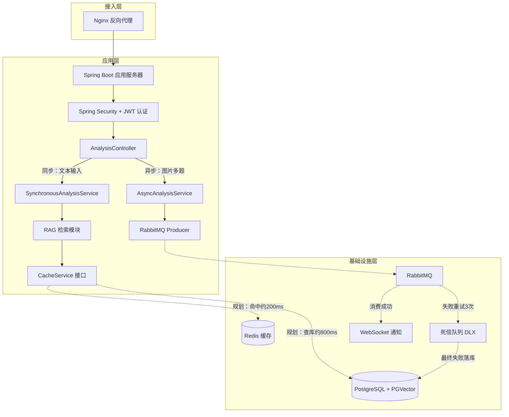
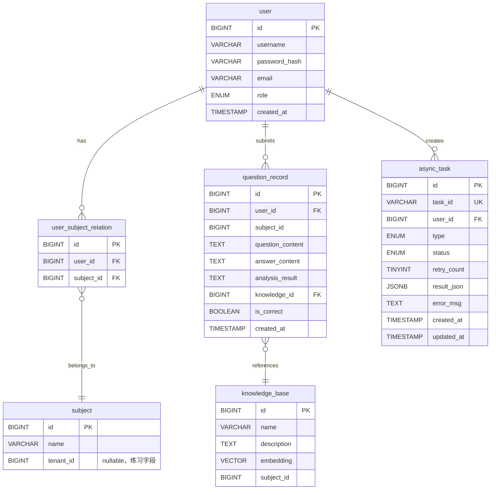

> *注：本文档为个人学习实践项目。部分高级功能（Redis/MQ/OCR异步处理）为规划与学习目标，当前已完成核心 MVP 链路的开发与验证。*

---

# AI 错题分析助手 —— 个人全栈项目实践与设计复盘

---

## 1. 项目背景

### 1.1 项目定位

面向初高中学生的 AI 错题分析工具。学生提交错题文本后，系统通过 RAG 检索对应知识点并生成错因分析与同类题推荐。

**MVP 验证结果**：5 名同学内测，3 人在未提示的情况下主动提交了第二道题（留存率 60%），说明核心 RAG + 错因分析对用户有价值。

### 1.2 架构原则

我采用**先跑通核心、再对症下药**的迭代策略：

| 阶段     | 做了什么                | 关键交付                                  |
| -------- | ----------------------- | ----------------------------------------- |
| MVP      | 验证 RAG 分析是否有留存 | 纯文本同步分析链路跑通，PGVector 直查     |
| 当前阶段 | 补权限隔离 + 预留扩展点 | Spring Security RBAC，CacheService 抽象层 |
| 规划阶段 | 解决已验证的性能瓶颈    | Redis 热点缓存，RabbitMQ 异步解耦         |

我的选型原则：先拿到日志/压测数据，再引入中间件，不搞"我觉得需要"式选型。

### 1.3 我的项目动机与学习目标

做这个项目的原因：

- **技术驱动**：想在实践中打通 Spring Boot + 向量数据库 + LLM API 的全链路，而不仅仅是看教程。
- **问题驱动**：观察到自己和身边同学整理纸质错题耗时低效，想验证 AI 能否解决这个具体痛点。
- **学习目标**：重点实践了**缓存抽象层设计**和**异步任务拆分**，这两点是我之前做 CRUD 项目时从未接触过的。

---

## 2. 整体架构图



> **图例说明**：  
> —— **实线箭头**：已实现并测试通过（文本同步分析 + 基础 RAG + RBAC 权限）  
>
> - - **虚线箭头**：规划中/正在开发（OCR 异步处理、Redis 缓存、RabbitMQ）

**已实现的数据流**：用户粘贴单题文本 → Controller → RAG 检索（PGVector 相似度搜）→ 同步返回分析结果。

---

## 3. 详细模块设计

### 3.1 用户权限模块（RBAC）

**目标**：实现学科维度的数据隔离。学生只能查看自己学科的错题。

**核心表关系**：

```
user ──┬── user_subject_relation ──┬── subject
       │
       └── role (student / teacher / admin)
```

**权限控制实现**：

```java
@PreAuthorize("@subjectGuard.canAccess(#subjectId)")
@GetMapping("/api/v1/questions")
public Result listQuestions(@RequestParam Long subjectId) { ... }
@Component("subjectGuard")
public class SubjectGuard {
    public boolean canAccess(Long subjectId) {
        UserDetails user = (UserDetails) SecurityContextHolder
            .getContext().getAuthentication().getPrincipal();
        return userSubjectRelationRepository
            .existsByUserIdAndSubjectId(user.getId(), subjectId);
    }
}
```

> **设计取舍说明**：我保留了 `subject` 表的 `tenant_id` 字段（nullable），不是为了"以后商业化"，而是**为了练习 Spring Security 的动态权限过滤**。我在开发中发现，如果一开始不留这个字段，后期想尝试 `@PreFilter` 注解时就得改表结构。所以这是一个"为了学习注解而预留的练习字段"，而非真正的商业规划。

### 3.2 缓存抽象层设计

**动机**：MVP 阶段没有中间件，但我不想让业务代码直接耦合"查库"逻辑。所以手写了一个 `CacheService` 接口做抽象层。

```java
public interface CacheService {
    <T> Optional<T> get(String key, Class<T> clazz);
    <T> void set(String key, T value, Duration ttl);
    void evict(String key);
}
// 当前实现：无缓存，直接透传查库
@Service
@ConditionalOnMissingBean(name = "redisCacheService")
public class LocalCacheService implements CacheService {
    @Override
    public <T> Optional<T> get(String key, Class<T> clazz) {
        return Optional.empty(); // 总是 miss，让调用方走数据库
    }
}
// 规划实现：通过配置文件开关激活 Redis
@Service
@ConditionalOnProperty(name = "app.cache.enabled", havingValue = "true")
public class RedisCacheService implements CacheService {
    private final RedisTemplate<String, Object> redis;
}
// 业务层代码——无论底层是 LocalCache 还是 RedisCache 都不需要改
@Service
public class KnowledgeSearchService {
    private final CacheService cache;
    private final PGVectorStore vectorStore;
 
    public List<KnowledgePoint> search(String keyword) {
        return cache.get("knowledge:" + keyword, KnowledgeList.class)
            .map(KnowledgeList::items)
            .orElseGet(() -> {
                List<KnowledgePoint> result = vectorStore.similaritySearch(keyword);
                cache.set("knowledge:" + keyword, new KnowledgeList(result), Duration.ofHours(24));
                return result;
            });
    }
}
```

> **为什么不用 Spring `@Cacheable`**：为了练习开闭原则。手写接口 + `@ConditionalOnProperty` 切换实现，让我真正理解了"依赖抽象不依赖具体"。虽然多写了几行代码，但比单纯加一个注解学到的东西多得多。

### 3.3 异步任务中心（规划）

**目标**：图片/多题提交场景下，OCR + 多题分析总耗时可能超过 5 秒，同步处理会触发 HTTP 超时。计划引入 RabbitMQ 做异步解耦。

**重试与兜底策略**：

```
消费失败 → 指数退避重试（1s → 2s → 4s，共 3 次）
        → 仍然失败 → 路由至死信队列
                   → 死信消费者落库 async_task（status = FAILED）
                   → 标记人工介入
```

**`async_task` 表关键字段**：

| 字段          | 类型        | 说明                                    |
| ------------- | ----------- | --------------------------------------- |
| `task_id`     | VARCHAR(64) | 对外暴露的任务标识                      |
| `user_id`     | BIGINT      | 提交用户                                |
| `type`        | ENUM        | 任务类型（IMAGE_OCR / BATCH_ANALYSIS）  |
| `status`      | ENUM        | PENDING → PROCESSING → SUCCESS / FAILED |
| `retry_count` | TINYINT     | 已重试次数                              |
| `error_msg`   | TEXT        | 失败原因，便于排查                      |

---

## 4. 核心数据库设计



---

## 5. 接口设计

### 5.1 同步分析（单题纯文本）

```
POST /api/v1/analysis/sync
Authorization: Bearer {jwt}
 
{
  "subjectId": 1001,
  "question": "已知 f(x) = x² + 2x + 1，求 f(x) 在 x = 1 处的切线方程。"
}
```

**响应**：

```json
{
  "code": 0,
  "data": {
    "knowledgePoint": "导数的几何意义",
    "errorAnalysis": "在求切线方程时，需要先对函数求导得到 f'(x)，再代入 x = 1...",
    "similarQuestions": [
      { "content": "已知 f(x) = x³ - 3x，求 f(x) 在 x = 2 处的切线方程。", "knowledgeId": 2047 }
    ]
  }
}
```

### 5.2 异步提交（规划中）

```
POST /api/v1/analysis/async
Content-Type: multipart/form-data
 
subjectId: 1001
files: [image1.png, image2.png]
```

**响应**（立即返回）：

```json
{ "code": 0, "data": { "taskId": "task_a1b2c3d4", "status": "PENDING" } }
```

### 5.3 轮询异步结果（规划中）

```
GET /api/v1/analysis/task/{taskId}
```

---

## 6. 开发踩坑与解决方案

这一章记录我在开发中真正遇到的坑，每个坑都逼我多学一点东西。

| 坑点                                          | 我的错误操作                                                 | 最终解决方案                                                 | 学到的东西                                                   |
| --------------------------------------------- | ------------------------------------------------------------ | ------------------------------------------------------------ | ------------------------------------------------------------ |
| **向量检索返回了其他学科的知识点**            | 直接把用户文本丢给 PGVector 做相似度检索，没按 `subject_id` 过滤。数学题检索出了语文知识点。 | SQL 查询中强制加 `WHERE subject_id = ?`，并建联合索引。      | 向量检索不是魔法，维度过滤和传统 SQL 一样重要。              |
| **粘贴文本带 Markdown 格式导致 LLM 输出混乱** | 用户从网页复制题目时带有 `#`、`**` 等格式标记，直接传给大模型返回了格式错乱的 JSON。 | 前端提交前用 `DOMParser` 清洗 HTML 标签，后端用正则合并多余换行符。 | LLM 对输入格式敏感，脏数据进 = 脏数据出。                    |
| **OCR 手写体识别准确率不到 70%**              | 起初设想全自动处理，不展示识别结果给用户。测试时发现大量错别字直接导致分析错误。 | 改为"半自动"：OCR 结果先在前端展示给用户确认，确认无误后才进入分析流程。 | 自动化率 ≠ 用户体验。有时候让用户"确认一下"比全自动更可靠。  |
| **Spring AI 版本升级导致 API 不兼容**         | 从 M7 升级到 1.0 时，`ChatClient` 的构建方式、`Advisor` 的注册方法都变了，代码全红。 | 逐文件改导入路径和方法签名，对照官方的 migration guide 排查。 | 跟随框架快速迭代时，做好"重构"的心理准备，不要怕改代码。     |
| **`application-local.yml` 差点提交到 Git**    | 把 API Key 写在了 `application.yml` 里，`git add .` 时差点提交。 | 在 `.gitignore` 里加 `application-local.yml`，用 `spring.profiles.active` 加载。 | 敏感信息管理是开发习惯，不是技术问题。第一次犯错可以，第二次就是事故。 |

---

## 7. 性能优化规划

### 7.1 从日志中发现的瓶颈

在 MVP 阶段，我通过日志发现两个明确的改进方向：

1. **热点知识检索慢**：Top 50 知识点占整体查询量的约 70%，单次 PGVector 检索约 **800ms**。如果这部分能缓存起来，整体响应速度会大幅提升。
2. **多题/图片场景同步超时**：OCR + 多题分析流程预估超过 5 秒，前端 HTTP 请求会超时，需要异步解耦。

### 7.2 计划引入的优化

| 优化项               | 触发原因                               | 当前耗时     | 优化预期                 |
| -------------------- | -------------------------------------- | ------------ | ------------------------ |
| Redis 缓存热点知识点 | Top 50 知识点高频命中，PGVector 检索慢 | ~800ms       | 预期降至 ~200ms          |
| RabbitMQ 异步解耦    | 多题/OCR 场景超 5s，HTTP 超时          | 超时失败     | 首响应 < 100ms，后台执行 |
| 死信队列兜底         | 无重试 → OCR 失败即丢弃                | 失败不可追溯 | 失败全量落库，可排查     |

> **说明**：以上优化目标为基于日志数据的预估，实际对比数据将在压测完成后补充。

---

## 8. 部署与运维

### 8.1 Docker Compose 一键部署

```yaml
services:
  app:
    build: .
    ports:
      - "8080:8080"
    environment:
      SPRING_PROFILES_ACTIVE: prod
      SPRING_DATASOURCE_URL: jdbc:postgresql://postgres:5432/error_analysis
      SPRING_REDIS_HOST: redis
      SPRING_RABBITMQ_HOST: rabbitmq
    depends_on:
      postgres:
        condition: service_healthy
      redis:
        condition: service_healthy
      rabbitmq:
        condition: service_healthy
 
  postgres:
    image: pgvector/pgvector:pg16
    environment:
      POSTGRES_DB: error_analysis
      POSTGRES_USER: app
      POSTGRES_PASSWORD: ${DB_PASSWORD}
    volumes:
      - pgdata:/var/lib/postgresql/data
    healthcheck:
      test: ["CMD-SHELL", "pg_isready -U app -d error_analysis"]
 
  redis:
    image: redis:7-alpine
    volumes:
      - redisdata:/data
    healthcheck:
      test: ["CMD", "redis-cli", "ping"]
 
  rabbitmq:
    image: rabbitmq:3-management-alpine
    environment:
      RABBITMQ_DEFAULT_USER: app
      RABBITMQ_DEFAULT_PASS: ${MQ_PASSWORD}
    ports:
      - "15672:15672"
    healthcheck:
      test: ["CMD", "rabbitmq-diagnostics", "check_port_connectivity"]
 
volumes:
  pgdata:
  redisdata:
docker compose --env-file .env up -d
```

---

## 附录：如果面试官问起

### Q1：为什么用向量数据库而不是 MySQL 全文索引？

因为关键词搜索只能匹配"导数"，但向量搜索能匹配"求变化率的问题"。实测向量检索能召回语义相关的知识点，而 `LIKE` 搜不到。这不是性能问题，是**召回质量**的问题。

### Q2：这个项目最难的部分是什么？

不是技术，是**数据**。没有现成的"错题→知识点"标注数据，我手动标注了 50 条样本做验证。这个过程让我意识到 AI 项目里数据质量比模型本身更关键。

### Q3：如果重新做，你会改什么？

会把日志和指标监控从第一天就做好。MVP 阶段我没加 Spring Actuator + Micrometer，后来想排查性能瓶颈时发现日志不全，补监控又得改代码。现在我知道了：监控不是"做完再加"，是"边写边加"。